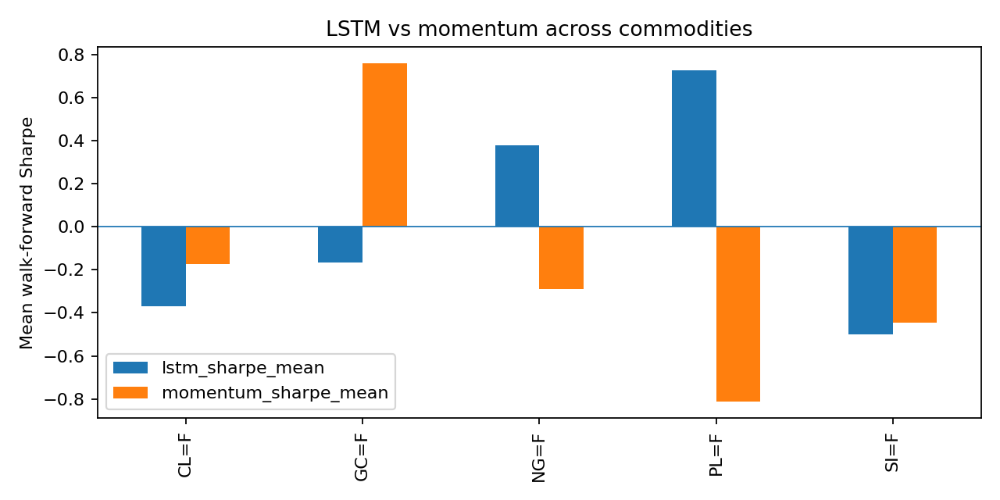
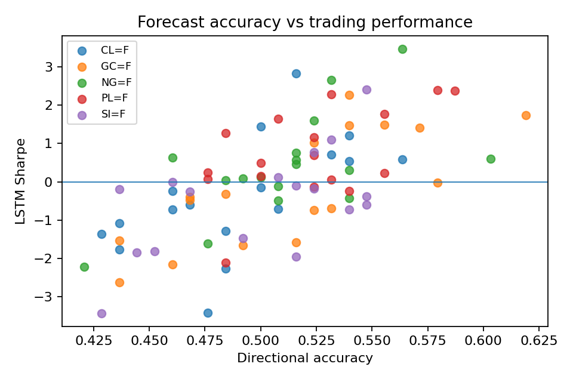

# Commodity Strategies Across Market Regimes

A small empirical study of simple trading signals and an LSTM baseline across energy and precious-metal futures.

I started this project to look at a practical question: do more flexible forecasting models actually produce more useful trading signals than simple rules, and does the answer change across commodity markets?

The study uses public daily price series for WTI crude oil, Henry Hub natural gas, gold, silver, and platinum. The backtests are evaluated with chronological walk-forward windows rather than random train/test splits.

## What is in the project

The project has two main parts:

- simple momentum, mean-reversion, and volatility-scaled strategies;
- an LSTM return-forecasting baseline evaluated against momentum out of sample.

I use AKQuant as the backtesting framework for the rule-based strategy experiments. The LSTM and result-analysis code is kept in this repository.

The analysis also separates low-, normal-, and high-volatility periods and includes transaction-cost sensitivity tests for the rule-based strategies.

## Data

The default downloader uses public Yahoo Finance continuous futures series:

| Market | Symbol |
| --- | --- |
| WTI crude oil | `CL=F` |
| Henry Hub natural gas | `NG=F` |
| Gold | `GC=F` |
| Silver | `SI=F` |
| Platinum | `PL=F` |

Raw downloaded data is not committed to the repository.

An earlier coal-equity proxy was removed from the final comparison because it is not equivalent to a thermal-coal futures benchmark.

## Evaluation

The main comparison uses chronological walk-forward evaluation. Each market contributes 17 out-of-sample windows, giving 85 commodity-window observations in the final five-market analysis.

For the trading comparison I focus on Sharpe ratio, drawdown, and the share of windows in which the LSTM signal has a higher Sharpe ratio than the momentum benchmark. Forecast RMSE, MAE, and directional accuracy are recorded separately.

WTI requires special treatment because the continuous futures series contains the April 2020 negative-price episode. Returns are therefore constructed without taking logarithms of non-positive prices. I also report a robustness comparison with the 2020 test windows excluded.

## Results

The main result is not that one model wins everywhere. Performance differs substantially across commodities.

| Market | Mean LSTM Sharpe | Mean Momentum Sharpe | LSTM win share |
| --- | ---: | ---: | ---: |
| WTI | -0.370 | -0.173 | 41.2% |
| Natural gas | 0.379 | -0.290 | 58.8% |
| Gold | -0.165 | 0.757 | 23.5% |
| Platinum | 0.725 | -0.811 | 82.4% |
| Silver | -0.501 | -0.447 | 58.8% |

The strongest relative LSTM result appears in platinum, where it beats the momentum benchmark in 82.4% of walk-forward windows. Natural gas also shows a smaller LSTM advantage. Gold gives the opposite result: the simple momentum benchmark is substantially stronger on average.

At the broad group level, the difference between energy and precious metals is much smaller than the variation between individual commodities. This makes the asset-level comparison more informative than a simple energy-versus-metals conclusion.



### Forecast accuracy and trading performance

Across the 85 walk-forward observations, LSTM directional accuracy and LSTM Sharpe have a correlation of **0.645**. Better directional forecasts are therefore associated with better risk-adjusted trading performance in this experiment, but the asset-level results show that forecast usefulness is still far from uniform across markets.



### WTI robustness

The weak WTI result is not driven only by the 2020 negative-price episode.

| WTI sample | Mean LSTM Sharpe | Mean Momentum Sharpe | Difference |
| --- | ---: | ---: | ---: |
| Full sample | -0.370 | -0.173 | -0.198 |
| Excluding 2020 windows | -0.376 | -0.179 | -0.197 |

The comparison changes very little after removing the 2020 test windows.

## Reproducing the analysis

Install the dependencies:

```bash
python -m pip install -r requirements.txt
```

Download the public market data:

```bash
python data/download_data.py
```

Run the data checks:

```bash
python analysis/data_checks.py
```

Run the LSTM walk-forward experiment:

```bash
python experiments/lstm_walk_forward.py
```

Then aggregate the results and generate the final figures:

```bash
python experiments/phase4_analysis.py
```

The rule-based experiments can be run separately from the scripts in `experiments/`.

## Repository layout

```text
analysis/       return construction, regimes, metrics, and result analysis
data/           public-data downloader and demo-data generator
experiments/    strategy, walk-forward, LSTM, and final analysis scripts
models/         LSTM implementation
strategies/     momentum, mean-reversion, and volatility-scaled strategies
tests/          research utility tests
results/        generated outputs; only final figures are kept in Git
```

## Limitations

This is a student research project rather than a production trading system. The public Yahoo Finance series are convenient continuous futures histories, not fully specified institutional futures curves, so contract rolls and execution details are simplified. The LSTM is intentionally a compact baseline rather than an extensively tuned deep-learning model. Transaction costs are examined in the rule-based experiments, but the final LSTM comparison should not be read as a claim of directly deployable profitability.

The sample contains only five final commodity series, and the apparent strength of the LSTM in platinum or natural gas should be treated as an empirical result for this experiment rather than evidence of a universal advantage. A natural extension would be to add a proper thermal-coal benchmark and study whether the cross-commodity differences can be explained by volatility, trend persistence, or other market characteristics.

## Framework

The rule-based backtesting experiments use the open-source **AKQuant** framework as a dependency. This repository contains my experiment design, strategy implementations, LSTM baseline, evaluation code, and analysis rather than a copy or rebranding of the AKQuant framework.
